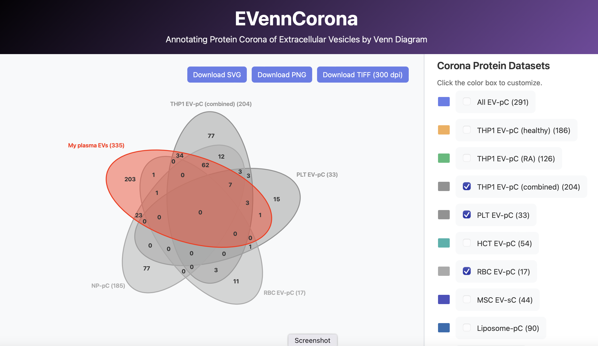

# EVennCorona: Annotating Protein Corona of Extracellular Vesicles by Venn Diagram

The protein corona, a dynamic layer of surface-adsorbed proteins commonly described for synthetic nanoparticles, also forms on the surface of extracellular vesicles (EVs) when they encounter protein-rich biofluids such as blood plasma. EVennCorona is a user-friendly, web-based tool designed to annotate EV protein coronas using Venn diagrams. Its database was constructed from experimental evidence derived from previoius proteomic analyses of EVs with and without corona proteins and includes 10 pre-defined datasets spanning diverse EV populations, such as those from stem cells, monocytes, epithelial cells, erythrocytes, and platelets. User-defined EV protein lists are annotated as protein corona when they overlap with the selected protein corona datasets in the database.

## Download the repository
- Option 1: Clone with Git
  - `git clone https://github.com/<your-org-or-username>/EVennCorona.git`
  - `cd EVennCorona`
- Option 2: Download ZIP
  - Click the green "Code" button on GitHub and choose "Download ZIP"
  - Unzip the file and open the folder

## How to use
- Open `index.html` directly in your web browser (recommended for quick use)
- Optional: run a local server if your browser blocks local file access
  - `python3 -m http.server 8000`
  - Then open `http://localhost:8000` in your browser

## Basic workflow
- Select up to 5 datasets from the control panel
- Optionally paste your own gene list in the User Input area; for example, CD9, TSG101, GAPDH, ALB, IGHG1, C3.
- The Venn diagram updates automatically as you change selections or inputs

## Optimize the diagram output
- Change dataset colors using the color pickers in the control panel
- Drag dataset labels to reposition them for readability
- Click any numeric region count to open the full gene list for that region
- Zoom in/out with mouse scroll to inspect dense intersections
